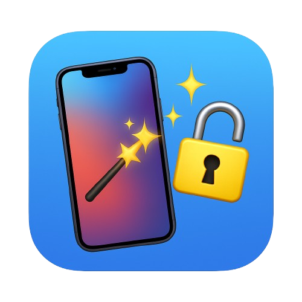

  
   
  <b>Magic Activator – Free iCloud Bypass Tool (redsn0w Edition)</b>

# Magic Activator – iCloud Activation Lock Bypass Tool (redsn0w Edition) 🪄🔓

## Overview ✨
Magic Activator is a **100% free Windows tool** that bypasses iCloud Activation Lock on iOS devices – no Apple ID or password needed.  
Spiritual successor of the legendary redsn0w, now supporting the latest iOS versions in 2025! 🚀

**Use ONLY on devices you own or have permission to unlock.**  
Bypassing iCloud violates Apple’s ToS – do it responsibly.

## Compatibility 📱
| Category              | Supported                                                                 |
|-----------------------|---------------------------------------------------------------------------|
| **iOS Versions**      | iOS 17.0 → iOS 26.1 (all builds) ✅ iOS 26.2 Beta 1 and below only ⚠️   |
| **Devices**           | A12 → A18 (iPhone Xs → iPhone 17 series & compatible iPads)               |
| **Best regions**      | LL/A, (Americas) 🌎                                                     |
| **Partial regions**   | Europe, Asia, China (more community files = better support)              |
| **Platform**          | Windows 10/11 (64-bit) 🖥️                                                |

## How It Works (Technical Deep Dive) 🛠️
1. Connect device via USB (DFU/Recovery mode) 🔌  
2. Tool reads ECID, model, region & iOS build 🔍  
3. Provide exact **MobileGestalt + supporting files**  
   → Extract in seconds with this shortcut:  
   https://www.icloud.com/shortcuts/0002e5bd9b7842bda3c2a83ad82033c9 📲  
4. Magic server generates a fake signed activation record 🎟️  
5. Record gets injected → device activated successfully 🎉  
6. OTA updates blocked automatically 🛡️  

**Success time:** 3–7 minutes ⏱️  
**>10 min = abort & retry after cooldown**

## Features 🔥
- Completely FREE (no hidden paid version) 💸  
- No jailbreak required 🚫  
- Real-time detailed logs 📜  
- OTA block 🛑  
- tvOS profile sideloading 📺  
- Weekly updates during beta season ⚡  

## Installation & Usage 🚀
1. Register for free → https://magicstore.qzz.io  
2. Download latest build (v1.1.0.2 or newer)  
3. Run as Administrator 👑  
4. Put device in DFU → select correct workflow → wait for the magic 🎇  

## Current Limitations ⚠️
- No full iCloud services (Drive, Find My, etc.)  
- No push notifications on some builds  
- Calls/SMS may be broken on GSM devices  
- iOS 26.2 Beta 2+ → currently **NOT supported** (Apple patched the exploit)

## Donations – Help Unlock the Future! ❤️
Magic Activator will **never** be paywalled, but your donations directly fund the next big features:

With your support we will add:
- Full Chinese (CH/A) & rare region support 🇨🇳🌍  
- Push notifications fix 📲  
- Partial iServices restoration (iCloud sign-in, Apple Pay, etc.)  
- DRM bypass for App Store & media  
- iOS 26.2+ support as soon as new methods are found  

**Donate here → https://www.paypal.com/paypalme/AlienSK**  
Every donation keeps the magic alive and speeds up new releases! ☕

All future builds & changelogs will be published right here on GitHub (closed-source binaries, open changelogs & community files).

## Roadmap (Actively in Development) 🗺️
- iOS 26.2+ bypass (when new exploit drops)  
- Native macOS version 🍎  
- Built-in MobileGestalt extractor  
- Full European & Chinese region packs  
- Misaka26/TrollStore integration  
- Weekly beta builds during iOS seasons  

## Screenshot 🖼️

  

## Credits & Love ❤️
- Lead developer: @DarkboyBeyond (Honduras 🇭🇳)  
- Inspired by redsn0w, checkra1n & the old jailbreak legends  
- Huge thanks to every file contributor and tester!  

## License
Proprietary binaries – free forever.  
Changelogs, docs & community files: MIT.

**Magic Activator – Bringing locked devices back to life, one bypass at a time.**  
Follow @DarkboyBeyond on X for instant updates! 🪄✨

*Last updated: November 30, 2025*
