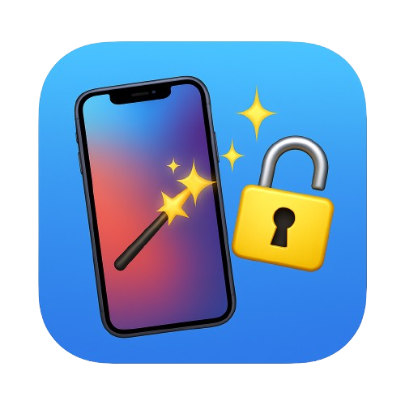
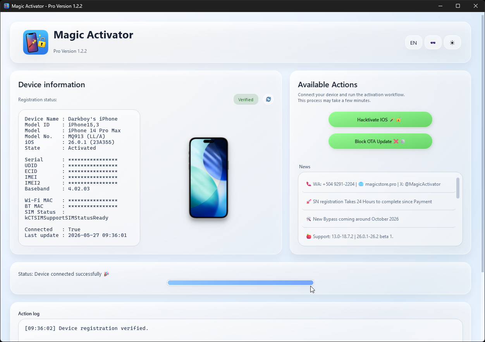
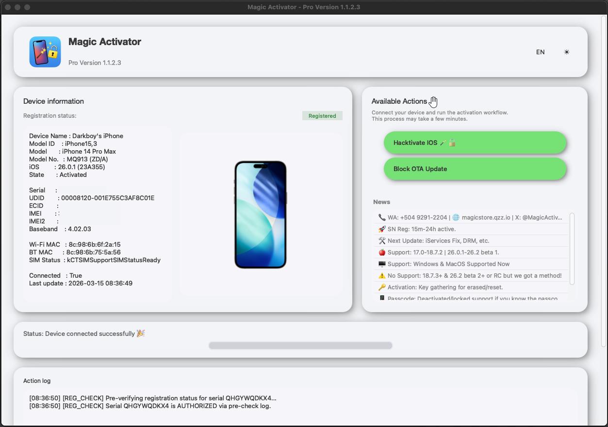

<div align="center">
  

  <h1>Magic Activator Pro 🪄🔓</h1>

  <p><b>Professional iCloud Activation Management Platform · Native Connection Engine · Windows & macOS</b></p>

  <p>
    
    
    
    
  </p>

  <p>
    <a href="https://github.com/darkboybeyond/Magic-Activator/stargazers"></a>
    <a href="https://github.com/darkboybeyond/Magic-Activator/network/members"></a>
    <a href="https://github.com/darkboybeyond/Magic-Activator/watchers"></a>
    <a href="https://github.com/darkboybeyond/Magic-Activator/releases"></a>
    
  </p>
</div>

---

## ✨ Overview

**Magic Activator Pro** is a professional activation-management platform for Windows and macOS. It combines a native Apple-device connection engine, secure server-side license validation, privacy-conscious diagnostics, guided activation workflows, and a polished cross-platform experience.

As the spiritual successor to the legendary redsn0w, it currently supports **iOS 13.0–18.7.2** and **iOS 26.0.1, 26.1, and 26.2 Beta 1**. Support for Chinese-region devices (CH/A) is under evaluation and will be clarified as testing progresses.

Additional MobileGestalt support files are available for compatible workflows. See the [supported-device list](https://magicstore.qzz.io/supported.html) for current availability.

> [!WARNING]
> **Use this software only on devices you own or are explicitly authorized to service.** Bypassing iCloud may violate Apple’s Terms of Service. Use it legally and responsibly.

---

## 📊 Project Growth & Downloads

<div align="center">
  <a href="https://github.com/darkboybeyond/Magic-Activator/releases">
    
  </a>
  <a href="https://github.com/darkboybeyond/Magic-Activator/stargazers">
    
  </a>
</div>

| Live project metric | Official GitHub source |
| :--- | :--- |
| ⭐ Community stars | [View stargazers](https://github.com/darkboybeyond/Magic-Activator/stargazers) |
| 📦 Release downloads | [View all releases](https://github.com/darkboybeyond/Magic-Activator/releases) |
| 🚀 Latest release | [Open the latest release](https://github.com/darkboybeyond/Magic-Activator/releases/latest) |
| 🍴 Community forks | [View repository forks](https://github.com/darkboybeyond/Magic-Activator/network/members) |

> [!NOTE]
> The counters above read the public GitHub repository directly and update automatically. No local chart image or additional project asset is required. Download totals count assets distributed through GitHub Releases.

---

## 🔥 Product Capabilities

### Native Connection Engine

- **Native API integration:** Direct Python 3.11.9 bindings communicate with Apple’s `usbmuxd` service without unstable subprocess-based CLI fallbacks, improving device detection on clean Windows installations.
- **Complete dependency handling:** Required runtime components, including `win32security` and lower-level Apple mobile-device libraries, are validated and handled to prevent silent connection-handshake failures.
- **Secure SSL communication:** Certificate handling allows the interface to retrieve software news, server status, support information, and version checks reliably.
- **Single Apple device session:** A thread-safe `AppleDeviceSession` singleton ensures that internal modules do not compete for the USB connection.
- **Trust and pairing preservation:** Valid pairing records remain available between sessions instead of being aggressively cleared at startup.
- **Resilient reconnection:** Smart exponential backoff uses 2s → 4s → 8s → 16s → 30s intervals to prevent reconnection storms, excessive CPU usage, and repeated `SSLZeroReturnError` events.
- **Native error recovery:** Lockdown, SSL, MuxException 183, and WinError 10061 conditions are handled while the app waits for device trust or pairing.

### Secure License Validation

Registration is verified in memory through the dedicated Activator origin:

```txt
check_sn.php?sn=DEVICE_SERIAL&origin=activator
```

- No direct registration-log download.
- No full registration log stored locally.
- Serial-number normalization before verification.
- Serial numbers and endpoint details hidden from the user-facing Action Log.
- Protected actions remain locked until license verification succeeds.
- A compact recheck button allows manual status verification.

| Status | Meaning |
| :--- | :--- |
| ✅ `registered` | Device is authorized |
| 🟡 `pending` | Registration or order is pending |
| ❌ `available` | Device is not registered |
| 🌐 `server_unavailable` | Registration server could not be reached |
| ⚠️ `invalid_response` | Server returned an invalid response |
| 🔄 `checking` | Registration verification is in progress |

### Privacy-Safe Action Log

The user-facing log masks full serial numbers, UDIDs, ECIDs, IMEIs, URLs containing `sn=`, and technical `check_sn.php` details. It replaces sensitive technical output with clear messages such as:

```txt
Device registration verified.
Device is not registered. Activation remains locked.
Device registration is pending. Activation remains locked.
Registration server unavailable. Activation remains locked.
```

### Liquid Glass V3 Experience

- Glass-style translucent cards, softer shadows, transparent labels, improved spacing, modern buttons, and cleaner scrollbars.
- Refined Action Log, News panel, progress card, and device-information card.
- True black iOS-style dark mode with graphite cards, soft white borders, and stronger contrast.
- Aligned visual language and shared source modules across Windows and macOS.
- Expanded English/Spanish translations and clearer UI text.

### Adaptive Device Preview

- Responsive device-card sizing based on available window space.
- Safe device-image rendering and a smoother shadow behind the preview.
- Image caching, resize debounce, and improved maximize/minimize behavior.
- Removal of unstable rendering methods that could affect redraw reliability.

### Performance Profiles

| Mode | Description |
| :--- | :--- |
| ⚡ **Performance** | Lightweight visuals for lower graphical overhead |
| ⚖️ **Balanced** | Recommended default profile |
| 💎 **Liquid** | Richest glass effects and visual quality |

The rendering engine reduces unnecessary redraws, caches device images, debounces resize events, improves animation handling, and lowers visual overhead on supported low-end hardware.

### Stability & Crash Protection

- Global crash guard and thread-exception handling.
- Runtime logs and crash reports with sensitive-data masking.
- Device-refresh protection and double-workflow prevention.
- USB polling pauses during sensitive AFC operations and exploit execution to avoid concurrent lockdown collisions.
- Thread-safe syslog initialization protects shared arguments during concurrent operations.
- A single daemon-based background security scanner prevents recursive thread accumulation and memory leaks.
- Improved handling of stale registration responses, workflow locks, UI redraws, OTA operations, and server-side support checks.

Diagnostic files are stored locally as:

```txt
logs/runtime.log
logs/crash_report.log
```

### Integrated Workflows

- Native device-data gathering and built-in steps for MobileGestalt extraction.
- No jailbreak required for supported workflows.
- Real-time detailed logs with privacy masking.
- OTA update blocking after bypass.
- Support-file checker and guided **Provide Support File** workflow.
- GUID Scan Method available under **Available Actions**.
- AUTO, FORCE LIVE, and FORCE OFFLINE scan modes.
- **Erase Pwned DFU for A12/A13 devices**, requiring a device already exploited with usbliter8 and a Waveshare RP2350 USB-A.
- Optional Developer Mode for advanced diagnostics.
- Weekly compatibility work during beta seasons.

---

## 🆔 GUID Setup

Some workflows require a GUID/UUID. A GUID is a globally unique identifier used by software systems and setup workflows; it is not a UDID, serial number, IMEI, or ECID.

### Accepted format

```txt
XXXXXXXX-XXXX-XXXX-XXXX-XXXXXXXXXXXX
```

Valid examples:

```txt
0148F643-4A5E-4CE0-AEC8-A89C787E1DD5
550E8400-E29B-41D4-A716-446655440000
A3D12E97-9F7B-42A8-8C2B-15B7D7B20F31
```

Invalid examples:

| Identifier | Invalid example |
| :--- | :--- |
| UDID | `00008110-001A2D0234F8001E` |
| Serial number | `F2LZK1ABCDEF` |
| IMEI | `356789123456789` |
| ECID | `0000023A00123456` |
| Incomplete GUID | `0148F643-4A5E-4CE0` |
| Invalid characters | `0148F643-4A5E-XXXX-AEC8-A89C787E1DD5` |

| Type | Description | Accepted in GUID Setup |
| :--- | :--- | :---: |
| GUID / UUID | Unique identifier used during setup workflows | ✅ |
| UDID | Apple device identifier | ❌ |
| Serial Number | Device hardware identifier | ❌ |
| IMEI | Cellular identifier | ❌ |
| ECID | Apple chip identifier | ❌ |

> [!WARNING]
> Do not enter a UDID, IMEI, ECID, or serial number into the GUID Setup field.

### Automatic GUID scan

1. Open **GUID Setup**.
2. Click **No** when asked whether you already know the GUID.
3. Wait for the scan to complete.
4. Continue when the identifier is detected.

<div align="center">
  
</div>

### Manual GUID input

1. Open **GUID Setup**.
2. Click **Yes**.
3. Enter a valid GUID manually.
4. Continue the workflow.

<div align="center">
  
</div>

The setup assistant includes format examples, invalid-identifier comparisons, clearer validation feedback, setup instructions, and troubleshooting guidance to reduce input errors.

---

## 📁 Provide Support File

Some iOS versions or device builds require an additional support file before the server can prepare the correct activation data. When required, Magic Activator Pro displays the **Provide Support File 📁** action.

<div align="center">
  
</div>

> [!IMPORTANT]
> Upload support files only from devices you own or have permission to service.

> [!CAUTION]
> Never publish serial numbers, UDIDs, IMEIs, ECIDs, or private device data.

---

## 🛠️ Optional Developer Mode

Developer Mode provides advanced technical visibility for technicians, testers, and developers:

- Additional diagnostic messages.
- Workflow debugging visibility.
- Extended validation information.
- Technical process details.
- Enhanced troubleshooting assistance.

> [!NOTE]
> Developer Mode is optional. Standard users can use all normal workflows without enabling it.

---

## ⚠️ Required Dependencies

> [!IMPORTANT]
> Magic Activator Pro requires **Python 3.11.9** and **pymobiledevice3 6.1.5**.

### Windows

1. Download and install [Python 3.11.9 (64-bit)](https://www.python.org/ftp/python/3.11.9/python-3.11.9-amd64.exe).
2. During installation, enable:

   ```txt
   Add Python to PATH
   ```

3. Open Command Prompt as Administrator and run:

   ```bash
   pip install pymobiledevice3==6.1.5
   ```

### macOS

The macOS application requires a valid Python 3.11.9 installation. It rejects `/usr/bin/python3` because the macOS system Python is unsuitable for this workflow.

Recommended path:

```txt
/Library/Frameworks/Python.framework/Versions/3.11/bin/python3.11
```

Install the required package:

```bash
/Library/Frameworks/Python.framework/Versions/3.11/bin/python3.11 -m pip install pymobiledevice3==6.1.5
```

The macOS build preserves the Python 3.11.9 selector, `/usr/bin/python3` blacklist, SSL workaround, AppleScript alerts, and `.icns` icon support. Its build pipeline, source modules, and Liquid Glass V3 interface are aligned with Windows.

---

## 💻 Hardware Requirements & Support Policy

Some operations rely on a time-sensitive race condition. Storage latency and processing performance directly affect whether commands complete inside the required timing window.

> [!CAUTION]
> Older computers, mechanical hard drives (HDDs), and systems with insufficient RAM are unsupported. Hardware latency may cause errors such as `[StealthPython] Error: Command timed out` and prevent the workflow from completing.

**Minimum host requirements:**

- Modern multi-core processor.
- Solid-state drive (SSD).
- Sufficient RAM for the operating system and device workflow.
- Supported 64-bit Windows or compatible macOS installation.

Support cannot be provided for failures caused by unsupported slow hardware. A valid technical support request must include:

1. **Full Action Log:** Copy the complete terminal/UI output without summarizing it.
2. **Device information:** Exact Apple model identifier, such as `iPhone12,1`, plus the current iOS version and build.
3. **Host specifications:** CPU model, RAM capacity, SSD/HDD type, and exact operating-system version.

Requests without the required diagnostic context may be closed because they cannot be investigated reliably.

---

## 📱 Compatibility

| Category | Supported |
| :--- | :--- |
| **Supported versions** | iOS 13.0 → 18.7.2; iOS 26.0.1, 26.1, and 26.2 Beta 1 ✅ |
| **Not supported yet** | iOS 18.7.3+ and iOS 26.2 Beta 2+ ⚠️ |
| **Devices** | A12 → A19; iPhone Xs through iPhone 17/Air series and compatible iPads |
| **Regions** | Global support, including LL/A, EU, and Asia; CH/A remains under evaluation 🌎 |
| **Desktop platforms** | Windows 10/11 64-bit and macOS 🖥️🍎 |

> [!NOTE]
> Compatibility varies by iOS build, region, device state, available support files, hardware performance, and server-side status.

---

## 🚀 Installation & Usage

1. Download the latest **v1.5 Legacy** build.
2. Install the required Python and pymobiledevice3 dependencies.
3. Run as Administrator on Windows, or open normally on macOS and grant the requested permissions.
4. Connect the device through USB in normal mode.
5. Wait for native device detection and complete Trust/Pairing if requested.
6. Review the registration status pill and verify the license state.
7. Select the appropriate action and follow the guided workflow.
8. Provide MobileGestalt and supporting files when requested.
9. Allow the Magic server to prepare the required activation data.
10. Complete the guided record-injection workflow.
11. Block OTA updates after completion when appropriate.

> [!TIP]
> A typical supported workflow completes in **3–7 minutes**. If it exceeds 10 minutes, abort it and retry after a cooldown period.

---

## ⚠️ Current Limitations

- No complete iCloud services such as iCloud Drive or Find My.
- Push notifications may not work on some builds.
- Calls and SMS may be unavailable on some GSM devices.
- iOS 18.7.3+ and iOS 26.2 Beta 2+ are not currently supported.
- Results depend on host hardware, device/build compatibility, available support files, region, and live server status.

---

## ❓ Issues & Responsible Reporting

Found a bug, a missing region/build, or have a feature request? Open a GitHub Issue with:

- Exact device model and identifier.
- iOS version and build number.
- Windows/macOS version and host hardware specifications.
- Full Action Log or sanitized runtime log.
- Screenshot or screen recording when useful.

> [!CAUTION]
> Remove full serial numbers, UDIDs, IMEIs, ECIDs, license data, private URLs, and other sensitive device information before posting publicly.

---

## 🗺️ Roadmap

- Research and integration for iOS 18.7.3+ and iOS 26.2 Beta 2+.
- Push-notification restoration work.
- Partial iServices restoration experiments.
- Expanded activation and GUID workflows.
- Improved macOS and Windows packaging, stability, and performance.
- Server infrastructure and support-file hosting improvements.
- Stabilization for rare device regions.
- Additional low-end hardware optimization within supported requirements.
- Continued Magic software-suite design alignment.
- Misaka26/TrollStore integration research.
- ~~Native macOS edition.~~
- ~~Built-in MobileGestalt extractor.~~

---

## 🖼️ Screenshots

<div align="center">
  <h3>Windows</h3>
  

  <br><br>

  <h3>macOS</h3>
  
</div>

---

## ❤️ Support & Future Development

Development focuses on broader compatibility, reliable native device communication, improved support-file workflows, stronger privacy protection, and consistent Windows/macOS releases. Future builds and changelogs will be published in this repository.

- 🌐 **Website:** [magicstore.pro](https://magicstore.pro/)
- 🧵 **Threads:** [@darkboybeyond](https://www.threads.net/@darkboybeyond)
- 💬 **WhatsApp Support:** [+504 9291-2204](https://wa.me/50492912204)

---

## ❤️ Credits & License

- Lead developer: [@DarkboyBeyond](https://github.com/darkboybeyond) · Honduras 🇭🇳
- Inspired by redsn0w, checkra1n, and the original jailbreak community.
- Special thanks to every support-file contributor and tester.

**License:** Proprietary binaries. Changelogs, documentation, and community files are available under the MIT License.

<div align="center">
  <p><b>Magic Activator Pro — professional activation management with native connectivity, privacy-safe validation, and Liquid Glass V3.</b></p>
  <p>Follow <a href="https://www.threads.net/@darkboybeyond">@darkboybeyond on Threads</a> for product updates. 🪄✨</p>
  
</div>

*Last updated: July 31, 2026*
